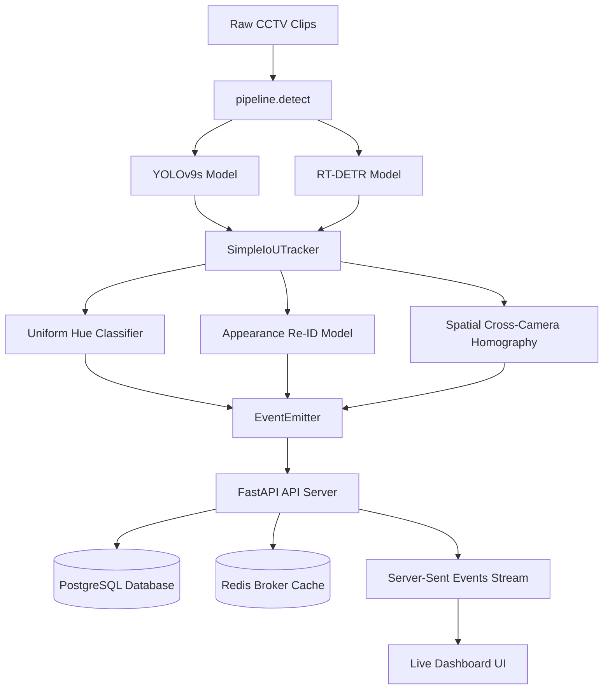

# 🔮 PurplleNerve: Real-Time Store Intelligence & Telemetry

PurplleNerve is a premium, end-to-end Store Intelligence system designed to ingest, process, and analyze raw anonymous CCTV footages from physical retail stores. Using state-of-the-art computer vision models, it tracks visitor behavior, classifies staff, identifies queue bottlenecks, and streams real-time telemetry straight to a high-fidelity visual dashboard.

---

## 🚀 Key Features

*   **Dual Object Detection Architecture**: 
    *   **YOLOv9s** for Entry and Floor camera views to achieve optimal speed/accuracy trade-off.
    *   **RT-DETR (ResNet50)** for Billing/POS camera zones to track checkout queues and resolve complex occlusions.
*   **Appearance-based Re-ID**: Stable visual embeddings matching visitors across entry/exit restarts.
*   **Spatial Deduplication (Cross-Camera Homography)**: Seamlessly merges overlapping field-of-views to prevent duplicate visitor counts.
*   **Staff Filtering**: Automatic hue classification to exclude staff members wearing uniform from conversion metrics.
*   **Structured Real-Time API**: Highly idempotent ingestion, anomaly detection, and conversion funnel pipelines.
*   **Live Telemetry Dashboard**: Responsive UI with interactive heatmap blueprints, Server-Sent Events (SSE), and metrics charts.

---

## 🛠️ System Architecture



---

## 🔌 Quick Start (5 Command Setup)

### Option 1: Docker (Containerized)

```bash
# 1. Clone the project and configure environment
git clone https://github.com/SathvigaaBharathi/PurplleNerve.git && cd PurplleNerve
cp .env.example .env

# 2. Spin up API, database, and Redis cache services
docker compose up -d postgres redis api

# 3. Run the ML pipeline on a sample CCTV clip
docker compose run pipeline python pipeline/detect.py \
  --clip /clips/CAM 1.mp4 \
  --store-id STORE_BLR_002 \
  --layout /data/store_layout.json \
  --output /output/events.jsonl \
  --api-url http://api:8000 \
  --real

# 4. Spin up mock transaction data & POS integration
curl -X POST http://localhost:8000/pos/load

# 5. Open the Live Dashboard
# Open http://localhost:8000/dashboard in your browser!
```

### Option 2: Native Run (Windows PowerShell)

```powershell
# 1. Configure the CCTV clips folder path in your .env file:
# CCTV_CLIPS_DIR=D:\purplle\CCTV Footage

# 2. Run the orchestrator to launch the server and all 5 camera pipelines:
python run_local_pipeline.py

```

---

## 📈 Analytics API Endpoints

| Method | Endpoint | Description |
| :--- | :--- | :--- |
| `POST` | `/events/ingest` | Ingest CV events (safe, idempotent, bulk insertion) |
| `GET` | `/stores/{id}/metrics` | Live occupancy, conversion rate, queue depth, quality score |
| `GET` | `/stores/{id}/stream` | Server-Sent Events (SSE) telemetry feed (push frequency: 2s) |
| `GET` | `/stores/{id}/funnel` | Entry → Zone Visit → Checkout Queue → Purchase funnel data |
| `GET` | `/stores/{id}/heatmap` | Dynamic zone visit counts and dwell metrics |
| `GET` | `/stores/{id}/anomalies` | Active queue congestion and off-hours intrusion alerts |
| `GET` | `/health` | Ingestion latency, database status, and stale feed alerts |
| `POST` | `/pos/load` | Load POS transaction CSV to correlate buyer conversion |

---

## 📊 Live Dashboard Interface

Open **[http://localhost:8000/dashboard](http://localhost:8000/dashboard)** to inspect:
*   **KPI Cards**: Live occupancy, conversion rates, check-out queue depth, and data quality metrics.
*   **Real-time Chart**: Auto-scrolling telemetry trend comparing unique visitors with checkout queue sizes.
*   **Store Floor Layout blueprint**: High-fidelity SVG floor map rendering color-coded, real-time dwell hot-spots.
*   **Purchase Funnel**: Progressive drop-off funnel showing conversion rates from entrance to purchase.
*   **Live Events Ticker**: Infinite scrolling list of raw CV events processed from edge camera feeds.

---

## 🧪 Testing and Coverage

The test suite covers DB models, SSE streaming, metrics calculation, anomalies, and pipeline components.

```bash
# Run pytest with coverage report (target: >70% statement coverage)
pytest --cov=app --cov-report=term-missing
```

---

## ⚙️ Environment Config

Copy `.env.example` to `.env` and adjust the variables:

*   `DATABASE_URL`: Connection string for Postgres database.
*   `REDIS_URL`: Connection string for Redis broker.
*   `LOG_LEVEL`: Logging output granularity (`DEBUG`, `INFO`, `WARNING`, `ERROR`).
